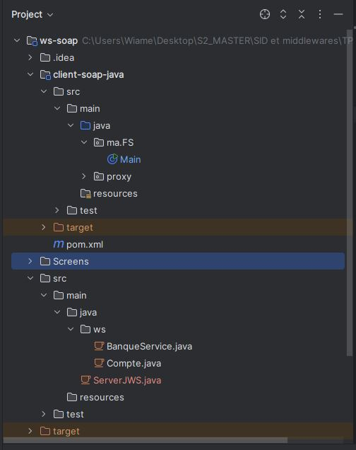
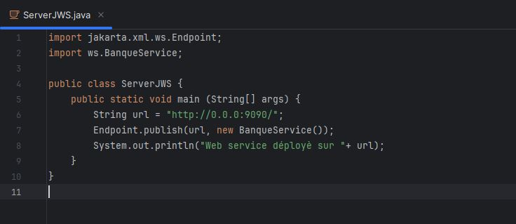
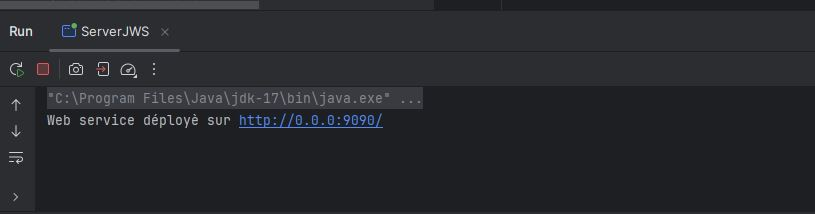
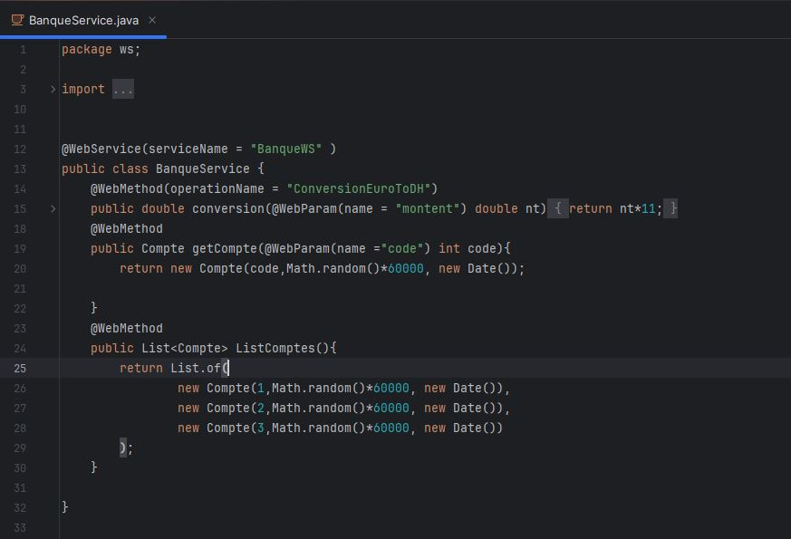
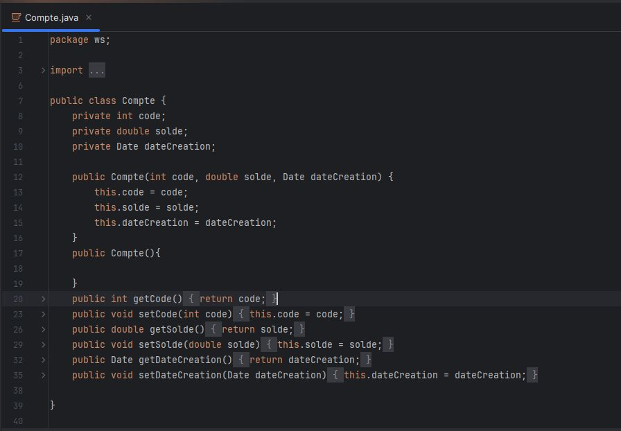
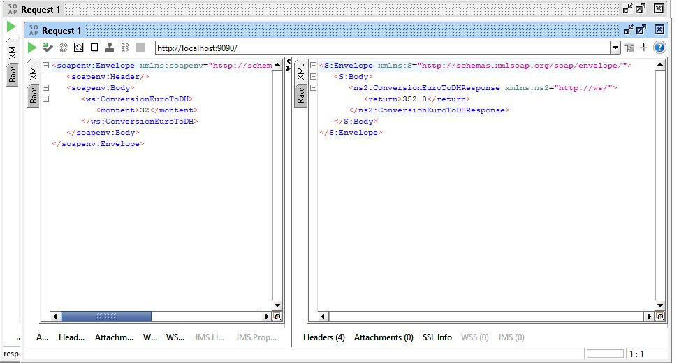
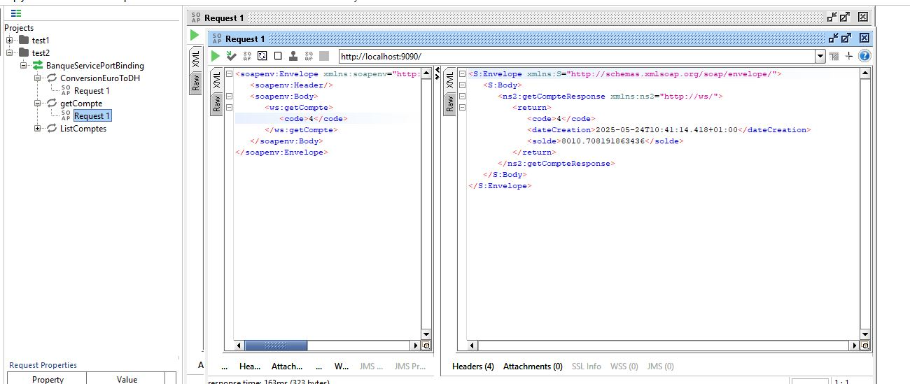
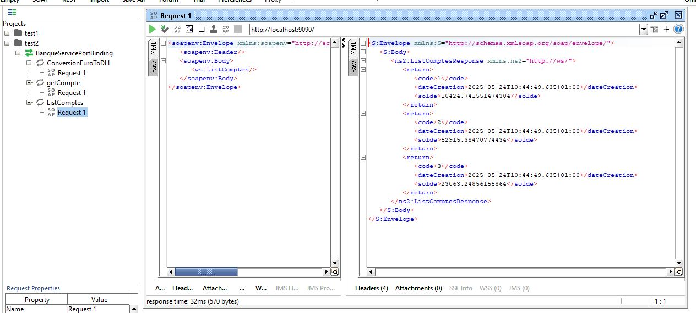
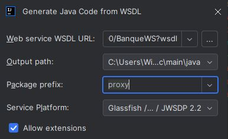
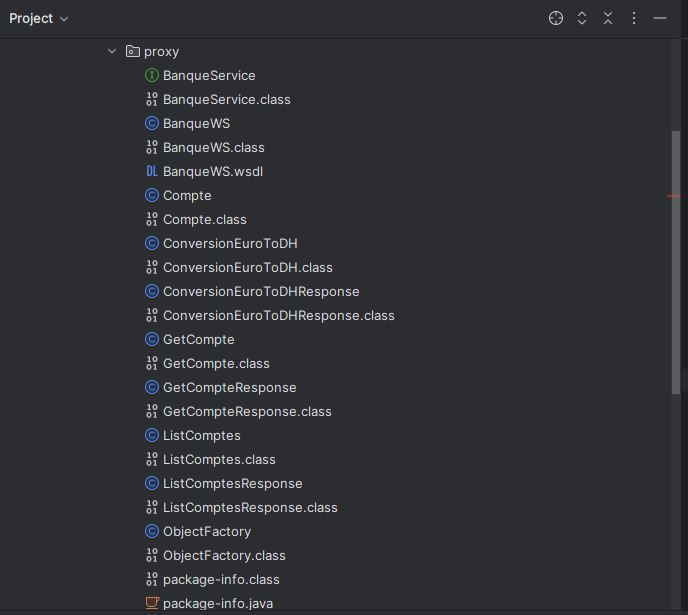

## Nom et Prénom : Anejjar Wiame
## Filière: MSDIA

---
# Rapport de TP 4 – Services Web SOAP avec JAX-WS

## 📌 Objectif du TP

L'objectif de ce TP est de concevoir et implémenter un service web SOAP basé sur le protocole WSDL en utilisant JAX-WS. Ce service permettra de :  

  - Convertir un montant de l'euro en dirhams (DH).  
  - Consulter un compte bancaire (solde et détails).  
  - Lister les comptes disponibles.

     
Les étapes clés incluent :
 
   - Le déploiement du service via un serveur JAX-WS.
   - L'analyse du WSDL généré.
   - Le test des opérations avec SoapUI.  
   - La création d'un client Java SOAP (génération des stubs à partir du WSDL).  

---

## 🧱 Structure du Projet

Le projet est organisé en deux modules principaux :  
### 1. Serveur SOAP (ws-soap):  

   Contient le package `ws` qui contient les classes suivantes:  
      - `BanqueService.java` : Interface du service web qui contient les méthodes (convertion, getCompte, listComptes).  
      - `Compte.java `: Classe d'entité représentant un compte bancaire.  
      -  `ServerJWS.java` : Point d'entrée pour publier le service avec Endpoint.publish(). 
      
### 2. Client SOAP (client-soap-java):

  - Contient le package `ma.fs` avec la classe : `Main.java` c'est le client Java utilisant les stubs générés (via wsimport).
  - Et le package `proxy` : Contient les classes générées automatiquement à partir du WSDL. 
    
    
 

 ---
## 📄 Explication détaillée 
  
---
 -` Protocole SOAP` : est un protocole de communication XML basé sur des standards, utilisé pour échanger des données structurées entre applications via des messages XML, généralement transportés par HTTP. Il garantit une interopérabilité entre systèmes hétérogènes grâce à son format strict et son contrat WSDL.

---

 ### 1. Serveur SOAP (ws-soap):
 
 ## 🗂 Package `Java` : 
 ### 1. Classe ServerJWS  :
La classe ServerJWS est le point de déploiement du service web SOAP, utilisant la classe Endpoint de JAX-WS. Elle contient une méthode main() qui publie le service BanqueService à l'adresse "http://0.0.0:9090/" via la méthode statique Endpoint.publish(). Cette opération permet de rendre le service accessible aux clients SOAP et génère automatiquement le WSDL correspondant (disponible à l'URL "http://0.0.0:9090/BanqueWS?wsdl"). Le message affiché dans la console ("Web service déployé sur...") confirme le succès du déploiement.  
Cette classe permet l'exposition du service bancaire sur le réseau, en permettant ainsi aux clients distants d'invoquer les opérations de conversion de devises et de gestion de comptes via des requêtes SOAP.

  
  
 
 ## 2. 🗂 Package `ws` : 
### - Classe BanqueService :
La classe BanqueService est un service web SOAP implémenté avec JAX-WS. Annotée avec @WebService(serviceName = "BanqueWS") pour définir le nom technique du service (BanqueWS) dans le WSDL généré, qui sera utilisé pour accéder au service via l'URL de déploiement (http://0.0.0:9090/BanqueWS?wsdl) , elle expose trois opérations accessibles via le protocole SOAP. Chaque méthode est marquée par @WebMethod, ce qui les rend disponibles dans le WSDL généré automatiquement. La méthode conversion(), annotée avec @WebMethod(operationName = "ConversionEuroToDH"), effectue une conversion de devises (euro vers dirham) en multipliant le montant par 11. Les méthodes getCompte() et ListComptes() permettent respectivement de récupérer un compte bancaire par son code et de lister plusieurs comptes, chacune utilisant @WebParam pour définir les noms des paramètres dans le WSDL. Les comptes sont instanciés avec des données simulées (solde aléatoire et date courante).  
Ce service sert de point central pour les opérations bancaires, en fournissant une interface standardisée via SOAP/WSDL pour une interopérabilité avec différents clients.

  

  ### - Classe Compte :
La classe Compte est une classe Java standard qui modélise un compte bancaire dans le système. Elle contient trois attributs principaux : code (identifiant unique du compte), solde (montant disponible) et dateCreation (date d'ouverture du compte). La classe propose deux constructeurs:  
     - Un constructeur par défaut et un constructeur paramétré initialisant tous les champs.  
     - Ainsi que les getters et setters correspondants pour chaque attribut, permettant ainsi une manipulation aisée des données.  
     
Cette classe sert de modèle de données pour les opérations du service web BanqueService, où elle est utilisée pour représenter les comptes retournés par les méthodes getCompte() et ListComptes(). La simplicité de sa structure en fait un objet facilement sérialisable en XML pour le transport via les messages SOAP, tout en permettant une extension future avec des fonctionnalités supplémentaires comme des opérations bancaires plus complexes.
  

---

### - Tests des opérations SOAP avec SoapUI : Requêtes/Réponses :
  
Nous avons utilisé SoapUI pour tester les différentes opérations du service web BanqueWS et vérifier le format des messages SOAP échangés. Voici les résultats obtenus pour les trois principales fonctionnalités :  
#### 1. la conversion euro-dirham :  Conversion de 32 EUR → 352 DH avec la structure XML des requêtes/réponses.

  
  
#### 2. La consultation d'un compte : Consultation d'un compte (code=4) avec les détails retournés (solde, date).

  
  

#### 3. Listing des comptes : Liste des comptes (3 comptes simulés avec données aléatoires).

  

---

### 2. Client SOAP (client-soap-java):
## 🗂️ Package `Java` : 
## 1. Package `ma.FS `:

### - Classe `main` : 
La classe Main elle utilise le proxy généré (via wsimport) pour se connecter au service en instanciant BanqueWS et en récupérant le port via getBanqueServicePort(). Le client teste trois opérations du service :   
    - (1) la conversion d'un montant (90 euros en dirhams via conversionEuroToDH()).  
    - (2) la récupération d'un compte spécifique (getCompte(4)) avec affichage de ses détails (code, solde, date).  
    - (3) le listing de tous les comptes (listCompte()) avec itération pour afficher leurs codes.  
Cette implémentation démontre l'interopérabilité SOAP en Java, où chaque appel de méthode déclenche une requête SOAP sous-jacente, avec les résultats désérialisés automatiquement en objets Java (Compte). Le client valide ainsi le bon fonctionnement du service tout en illustrant le pattern standard de consommation des web services SOAP via des stubs générés.  

## 2. Package `proxy` : 

Ce package contient les classes générées automatiquement par l'outil wsimport à partir du WSDL du service web BanqueWS. Il inclut :  
    - Les interfaces proxy (BanqueService, BanqueWS) pour consommer le service SOAP.
    - Les classes de requêtes/réponses (ConversionEuroToDH, GetCompteResponse) représentant les messages SOAP.
    - Les objets métier (Compte) et une fabrique (ObjectFactory) pour créer les instances XML.
La génération s'est faite via wsimport (outil JAX-WS) en pointant vers l'URL du WSDL (http://localhost:9090/BanqueWS?wsdl), avec le préfixe proxy pour organiser le code.  

 
 
Ces classes servent de pont entre le client Java et le service SOAP, en encapsulant la complexité des appels réseau et la désérialisation XML. Elles permettent d'invoquer les opérations du service (conversionEuroToDH()) de manière transparente, comme des méthodes Java locales.

 

  
  
---
 ## - Conclusion
Ce TP a permis de maîtriser la création de services web SOAP/WSDL avec JAX-WS, depuis le déploiement jusqu'au développement d'un client Java. Les compétences acquises incluent :    
       - La génération automatique de WSDL.  
       - L'utilisation de stubs pour simplifier les appels SOAP.  
       - L'analyse des messages XML échangés.  
Ce projet démontre l'interopérabilité des services SOAP, idéale pour les systèmes hétérogènes nécessitant une communication standardisée.

---
 
  
